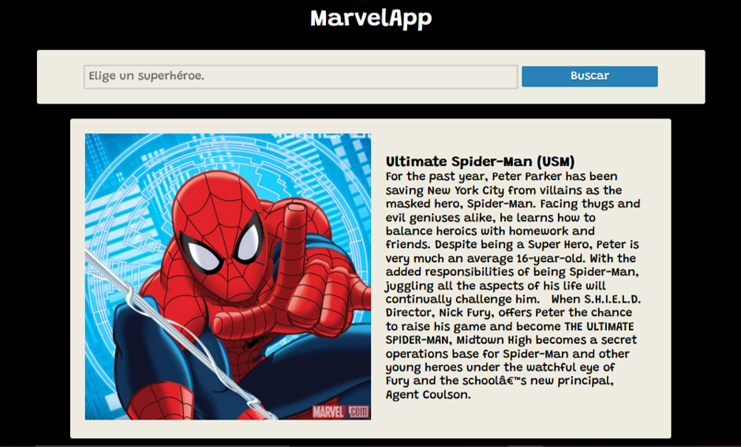

# MarvelApp

Aplicación que nos muestra diferentes personajes del universo Marvel, además de diferentes cómics en donde podemos encontrar a ese personaje.

## Run

El proyecto está hecho con create-react-app, así que solo es necesario instalar los módulos de node que requiere la aplicación con "npm install".

## Consideraciones 

Toda la información se obtiene de la [Marvel Comics API](https://developer.marvel.com/)  .
  
  

